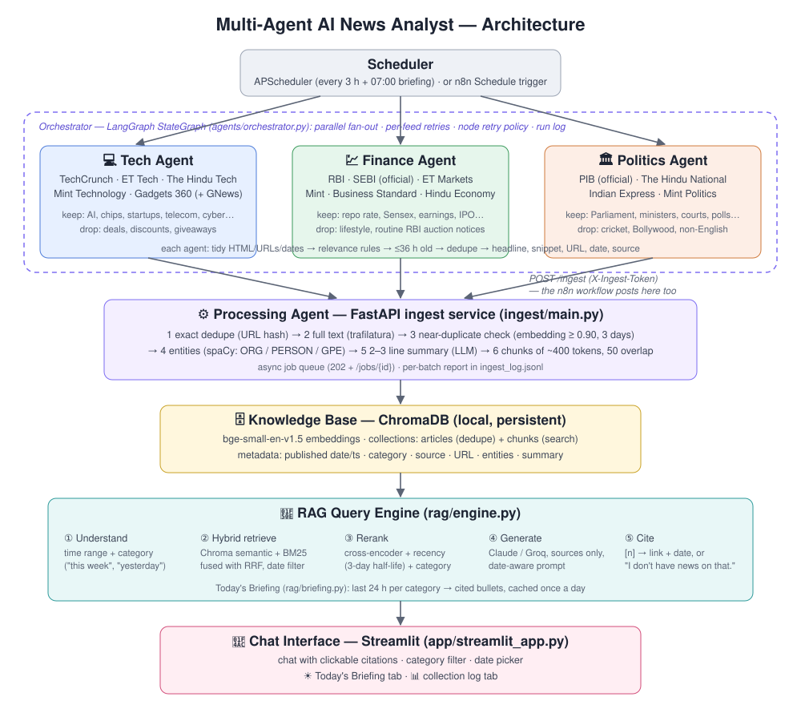
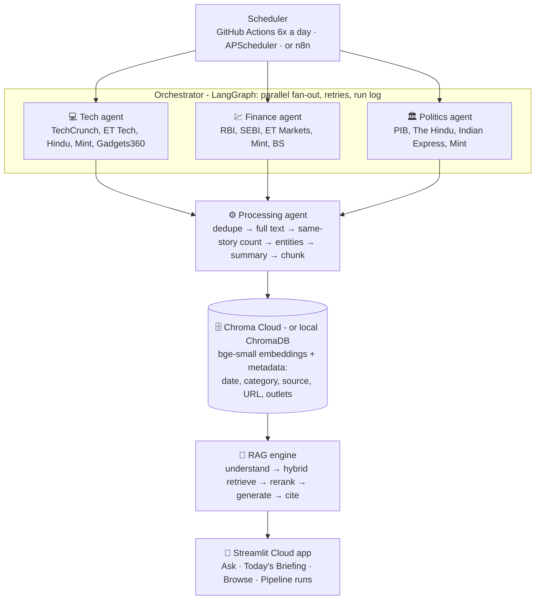

# 📰 Multi-Agent AI News Analyst

*GoldenEagle Program · Capstone 1*

Three specialised AI agents collect the day's **Technology, Finance and Politics** news from Indian and global sources, including official ones such as **RBI, SEBI and PIB**. A processing agent cleans, de-duplicates, summarises, tags and chunks the articles into a **ChromaDB** knowledge base. A **RAG** engine answers questions like *"What did the RBI announce this week and how did markets react?"* in a Streamlit chat. Answers come only from collected news, cite their sources with links and dates, and say **"I don't have news on that."** instead of guessing.

## Problem

Professionals can't read hundreds of sources a day. General chatbots either don't know today's news or can't show where an answer came from. This app is a personal news analyst that stays current, organises news by domain, and answers only from verified sources.

## Architecture





| Component | What it does | Where |
|---|---|---|
| **Fetcher agents** (×3) | Each agent has its own feeds (RSS, official RBI/SEBI/PIB feeds, optional GNews API) and relevance rules: *keep* words, *drop* words, and strict on-topic checks. They tidy HTML, URLs and dates, drop items older than 36 h and non-English items, and de-duplicate. | `agents/fetchers.py`, `agents/sources.py` |
| **Orchestrator** | A LangGraph `StateGraph` runs the three agents in parallel, waits for all of them, hands the batch to processing, then does housekeeping (deletes news older than 30 days, writes the morning briefing). Each feed gets 3 retries with back-off, a crashed agent doesn't stop the others, and processing has a `RetryPolicy`. Every run report is saved in the knowledge base. In the cloud, **GitHub Actions** runs it 6 times a day; locally, APScheduler (`start_agents.bat`). | `agents/orchestrator.py`, `.github/workflows/collect.yml` |
| *(alternative)* **n8n workflow** | Same flow built visually in n8n: Schedule → RSS → Filter & Tidy → POST /ingest. | `n8n/01_news_fetcher.json` |
| **Processing agent** | Runs as a FastAPI service (for n8n and the local scheduler) or in-process (`--inline`, GitHub Actions). It drops exact duplicates (URL hash), downloads the full text (trafilatura), and skips near-duplicates (the same story from another outlet: embedding similarity ≥ 0.90 within 3 days) while counting them as extra **outlets** for the original. It also extracts entities (spaCy), writes a 2–3 line summary (Groq), splits text into ~400-token chunks with 50 overlap, embeds them, and stores them. | `ingest/main.py` |
| **Knowledge base** | **Chroma Cloud** when `CHROMA_API_KEY` is set (shared by the collector, the cloud app and your laptop), otherwise a local ChromaDB folder. Collections: `articles` (dedupe, outlet counts), `chunks` (search) and `meta` (run reports, daily briefings). Metadata on every chunk: `published_ts`, `category`, `source`, `url`, `entities`, `summary`, which enables filters such as *finance, last 7 days*. | `rag/store.py` |
| **RAG engine** | ① infers the time range and category from the question; ② hybrid search (Chroma semantic + BM25 keyword, fused with Reciprocal Rank Fusion), splitting compound questions; ③ reranks with the `ms-marco-MiniLM-L-6-v2` cross-encoder plus a recency boost (3-day half-life) and a category boost; ④ the LLM answers **only** from the numbered sources with a date-aware prompt; ⑤ returns the cited sources, or *"I don't have news on that."* when the best match is below the relevance threshold. | `rag/engine.py` |
| **Today's Briefing** | Top 5 stories per domain from the last 24 h, **ranked by how many outlets covered each story**. Same-story articles are grouped by embedding similarity plus a shared distinctive headline word. Written once each morning and saved in the knowledge base. | `rag/briefing.py` |
| **Chat interface** | Streamlit app with four tabs: **Ask** (chat with clickable `[n]` citations and dated sources), **Today's Briefing** (two-column layout), **Browse** (search and filter every stored article) and **Pipeline runs** (GitHub Actions and orchestrator reports). The sidebar has category filters, a *Restrict dates* toggle, knowledge-base stats per category, and **Collect news now**. | `app/streamlit_app.py` |

**Stack:** Python 3 · LangGraph · APScheduler (or n8n) · FastAPI · trafilatura · spaCy · sentence-transformers (`BAAI/bge-small-en-v1.5`, `cross-encoder/ms-marco-MiniLM-L-6-v2`) · ChromaDB / Chroma Cloud · rank-bm25 · GitHub Actions · Claude (`claude-opus-5-5`) or Groq Llama · Streamlit

## Setup (Windows)

```bat
cd Capstone1_Newsreader
python -m venv venv
venv\Scripts\activate
pip install -r requirements.txt
python -m spacy download en_core_web_sm
copy .env.example .env      &REM then edit .env
```

In `.env` set **one LLM key**, either `ANTHROPIC_API_KEY` (Claude) or `GROQ_API_KEY` (Groq, free tier). Also set `INGEST_TOKEN` to any long random string. Without an LLM key everything still runs, but the chat shows the best-matching articles instead of a written answer, and articles get no summaries.

The first run downloads the embedding model (~130 MB) and the reranker (~90 MB) once.

## Run

Open three terminals, or double-click the `.bat` files:

| Step | Command | What |
|---|---|---|
| 1 | `start_ingest.bat` | Processing service on http://127.0.0.1:8000 (`/health`, `/jobs/latest`) |
| 2 | `start_agents.bat` | Runs the agents now, then every 3 h, plus the 07:00 briefing. For a single run use `python -m agents.orchestrator` |
| 3 | `start_app.bat` | Chat app at http://localhost:8501 |

Useful one-liners:

```bat
python -m agents.fetchers finance                 :: try one agent, no storing
python -m rag.engine "What did SEBI announce today?"
python -m rag.briefing                            :: print today's briefing
python -m agents.orchestrator --briefing          :: force-regenerate it
python -m eval.smoke_test                         :: quick pass/fail regression checks
python -m eval.run_eval                           :: 25-question evaluation -> eval/results/
```

## Live deployment (always current, no laptop needed)

```
GitHub Actions (6x a day)  ──writes──▶  Chroma Cloud  ◀──reads──  Streamlit Cloud app
  3 agents + processing                 shared store              Ask · Briefing · Browse
```

1. **Chroma Cloud:** sign up at trychroma.com and create a database. Note the **API key**, **tenant** and **database** name.
2. **Copy the news you already have** (optional, one time): put `CHROMA_API_KEY`, `CHROMA_TENANT` and `CHROMA_DATABASE` into `.env`, then run `python -m scripts.migrate_to_cloud`.
3. **GitHub:** repo → *Settings → Secrets and variables → Actions → New repository secret*. Add `CHROMA_API_KEY`, `CHROMA_TENANT`, `CHROMA_DATABASE`, and optionally `GROQ_API_KEY` (summaries), `ANTHROPIC_API_KEY` (briefing takeaways) and `GNEWS_API_KEY`. Then go to *Actions → Collect news → Run workflow* to test it.
4. **Streamlit Cloud:** main file `app/streamlit_app.py`, *Advanced settings → Python 3.12*, and these Secrets:
   ```toml
   CHROMA_API_KEY = "..."
   CHROMA_TENANT = "..."
   CHROMA_DATABASE = "..."
   ANTHROPIC_API_KEY = "..."     # or GROQ_API_KEY
   GH_DISPATCH_TOKEN = "..."     # optional: enables "Collect news now" (fine-grained token, Actions: read and write)
   ```
   Streamlit installs `app/requirements.txt` (app only, CPU PyTorch). The collector uses `requirements-collector.txt`.

Once `CHROMA_API_KEY` is in your local `.env`, your laptop app reads the same live data. The evaluation always uses the frozen `eval/kb_snapshot`.

## How the answer stays grounded

- **Retrieval gate:** if the cross-encoder's best relevance score is below `RELEVANCE_MIN` (0.10), the LLM is never called and the reply is *"I don't have news on that."*
- **Prompt rules:** use only the numbered sources, cite every sentence `[n]`, say when things happened, flag disagreements, no outside knowledge, and use the exact refusal sentence when the sources don't answer.
- **Citation check:** only sources the answer actually cites are shown, each with its link, outlet and publication date/time.
- **Date awareness:** "today / yesterday / this week / last N days" become hard date filters; otherwise newer articles get a recency boost. Today's date is in the prompt.

## Project layout

```
agents/      fetcher agents, their sources & rules, LangGraph orchestrator + scheduler
ingest/      FastAPI processing service (dedupe, full text, entities, summary, chunk, embed)
rag/         engine.py (RAG), briefing.py (daily briefing), llm.py (Claude / Groq switch)
app/         Streamlit chat interface
eval/        questions.csv (25), run_eval.py, smoke_test.py, REPORT.md, results/, kb_snapshot/ (frozen 5 Oct data)
n8n/         n8n workflow + Code-node scripts (alternative orchestrator)
scripts/     migrate_to_cloud.py (one-time copy of local news into Chroma Cloud)
.github/     workflows/collect.yml (scheduled collector)
docs/        architecture.svg
data_chroma/ local ChromaDB + logs when no cloud key is set (git-ignored)
```

## Limitations and next steps

- Some outlets (e.g. paywalled ones) give only the RSS snippet, not the full text. The ingest report counts `text_full` vs `text_snippet`.
- Evaluation: see [eval/REPORT.md](eval/REPORT.md). Retrieval-level results (run 3): 20/20 expected sources cited (19 ranked first), 5/5 time windows respected, 0 false refusals, about 5 s per question. Near-miss unanswerable questions rely on the LLM's refusal rule.
- GitHub pauses scheduled workflows in repositories with no commits for 60 days. Re-enable it under the Actions tab if that happens.
