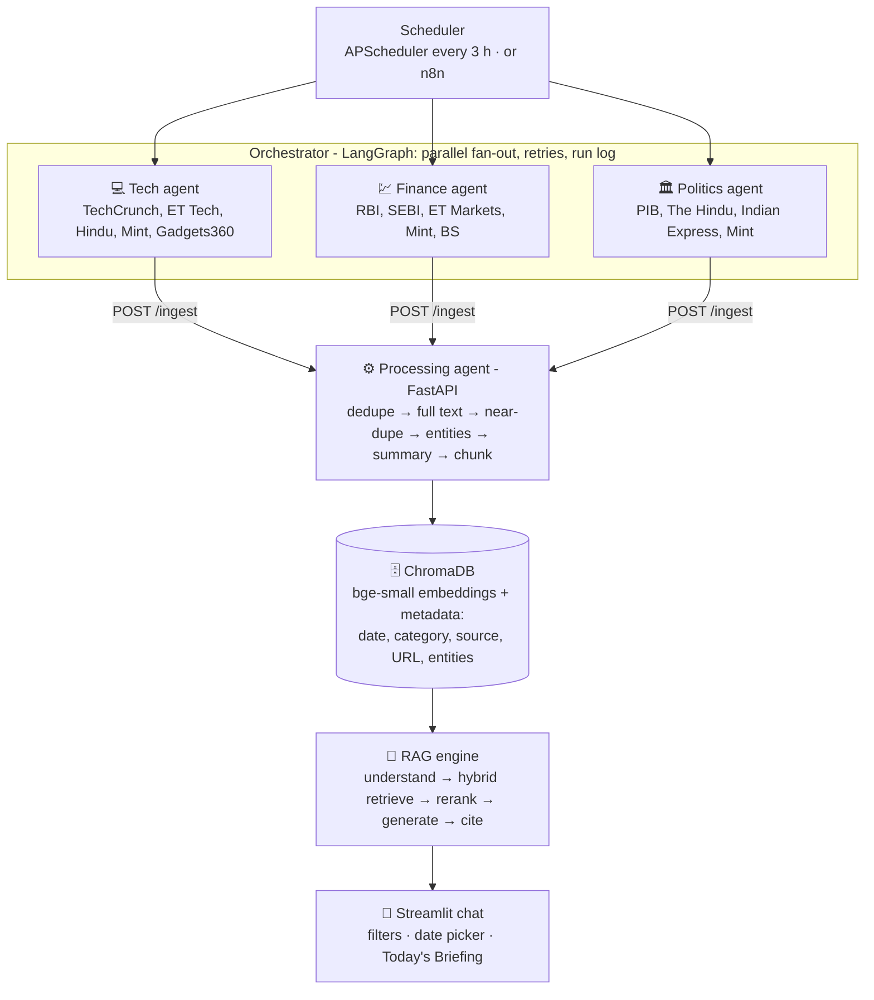

# 📰 Multi-Agent AI News Analyst

*GoldenEagle Program · Capstone 1*

Three specialised AI agents collect the day's **Technology, Finance and Politics** news from Indian and global sources, including official ones such as **RBI, SEBI and PIB**. A processing agent cleans, de-duplicates, summarises, tags and chunks the articles into a **ChromaDB** knowledge base. A **RAG** engine answers questions like *"What did the RBI announce this week and how did markets react?"* in a Streamlit chat. Answers come only from collected news, cite their sources with links and dates, and say **"I don't have news on that."** instead of guessing.

## Problem

Professionals can't read hundreds of sources a day. General chatbots either don't know today's news or can't show where an answer came from. This app is a personal news analyst that stays current, organises news by domain, and answers only from verified sources.

## Architecture




| Component | What it does | Where |
|---|---|---|
| **Fetcher agents** (×3) | Each agent has its own feeds (RSS, official RBI/SEBI/PIB feeds, optional GNews API) and relevance rules: *keep* words, *drop* words, and strict on-topic checks. They tidy HTML, URLs and dates, drop items older than 36 h and non-English items, and de-duplicate. | `agents/fetchers.py`, `agents/sources.py` |
| **Orchestrator** | A LangGraph `StateGraph` runs the three agents in parallel, waits for all of them, then hands the batch to processing. Each feed gets 3 retries with back-off, a crashed agent doesn't stop the others, and processing has a `RetryPolicy`. Every run is logged to `orchestrator_log.jsonl`. APScheduler runs it every 3 h and builds the briefing at 07:00. | `agents/orchestrator.py` |
| *(alternative)* **n8n workflow** | Same flow built visually in n8n: Schedule → RSS → Filter & Tidy → POST /ingest. | `n8n/01_news_fetcher.json` |
| **Processing agent** | FastAPI service. It drops exact duplicates (URL hash), downloads the full text (trafilatura), skips near-duplicates (the same story from another outlet: embedding similarity ≥ 0.90 within 3 days), extracts entities (spaCy), writes a 2–3 line summary (LLM), splits text into ~400-token chunks with 50 overlap, embeds them, and stores them. | `ingest/main.py` |
| **Knowledge base** | ChromaDB with two collections: `articles` (for dedupe) and `chunks` (for search). Metadata on every chunk: `published_ts`, `category`, `source`, `url`, `entities`, `summary`, which enables filters such as *finance, last 7 days*. | `data_chroma/` |
| **RAG engine** | ① infers the time range and category from the question; ② hybrid search (Chroma semantic + BM25 keyword, fused with Reciprocal Rank Fusion), splitting compound questions; ③ reranks with the `bge-reranker-base` cross-encoder plus a recency boost (3-day half-life) and a category boost; ④ the LLM answers **only** from the numbered sources with a date-aware prompt; ⑤ returns the cited sources, or *"I don't have news on that."* when the best match is below the relevance threshold. | `rag/engine.py` |
| **Today's Briefing** | Last 24 h per category turned into cited bullets, generated once a day and cached. | `rag/briefing.py` |
| **Chat interface** | Streamlit app with a chat window, clickable `[n]` citations, a sources panel with dates, a category filter, a date picker (auto / 24 h / 7 days / custom), a Briefing tab, and a collection-log tab. | `app/streamlit_app.py` |

**Stack:** Python 3 · LangGraph · APScheduler (or n8n) · FastAPI · trafilatura · spaCy · sentence-transformers (`BAAI/bge-small-en-v1.5`, `BAAI/bge-reranker-base`) · ChromaDB · rank-bm25 · Claude (`claude-opus-5-5`) or Groq Llama · Streamlit

## Setup (Windows)

```bat
cd Capstone1_Newsreader
python -m venv venv
venv\Scripts\activate
pip install -r requirements.txt
python -m spacy download en_core_web_sm
copy .env.example .env      &REM then edit .env
```

In `.env` set **one LLM key**, either `ANTHROPIC_API_KEY` (Claude) or `GROQ_API_KEY` (Groq, free tier). Also set `INGEST_TOKEN` to any long random string. Without an LLM key everything still runs, but the chat shows the best-matching articles instead of a written answer, and articles get no summaries.

The first run downloads the embedding model (~130 MB) and the reranker (~1.1 GB) once.

## Run

Open three terminals, or double-click the `.bat` files:

| Step | Command | What |
|---|---|---|
| 1 | `start_ingest.bat` | Processing service on http://127.0.0.1:8000 (`/health`, `/jobs/latest`) |
| 2 | `start_agents.bat` | Runs the agents now, then every 3 h, plus the 07:00 briefing. For a single run use `python -m agents.orchestrator` |
| 3 | `start_app.bat` | Chat app at http://localhost:8501 |

Useful one-liners:

```bat
python -m agents.fetchers finance                 :: try one agent, no storing
python -m rag.engine "What did SEBI announce today?"
python -m rag.briefing                            :: print today's briefing
python -m agents.orchestrator --briefing          :: force-regenerate it
python -m eval.smoke_test                         :: pass/fail checks
```

## How the answer stays grounded

- **Retrieval gate:** if the cross-encoder's best relevance score is below `RELEVANCE_MIN` (0.10), the LLM is never called and the reply is *"I don't have news on that."*
- **Prompt rules:** use only the numbered sources, cite every sentence `[n]`, say when things happened, flag disagreements, no outside knowledge, and use the exact refusal sentence when the sources don't answer.
- **Citation check:** only sources the answer actually cites are shown, each with its link, outlet and publication date/time.
- **Date awareness:** "today / yesterday / this week / last N days" become hard date filters; otherwise newer articles get a recency boost. Today's date is in the prompt.

## Project layout

```
agents/      fetcher agents, their sources & rules, LangGraph orchestrator + scheduler
ingest/      FastAPI processing service (dedupe, full text, entities, summary, chunk, embed)
rag/         engine.py (RAG), briefing.py (daily briefing), llm.py (Claude / Groq switch)
app/         Streamlit chat interface
eval/        smoke_test.py (RAGAS evaluation = Phase 5)
n8n/         n8n workflow + Code-node scripts (alternative orchestrator)
docs/        architecture.svg
data_chroma/ ChromaDB files, ingest / orchestrator logs, cached briefings (git-ignored)
```

## Limitations and next steps

- Some outlets (e.g. paywalled ones) give only the RSS snippet, not the full text. The ingest report counts `text_full` vs `text_snippet`.
- Reranking runs on CPU and takes about 7–10 s per question. Setting `RERANK_MODEL=cross-encoder/ms-marco-MiniLM-L-6-v2` is about 5× faster.
- Phase 5: RAGAS evaluation (faithfulness, answer relevancy, context precision) on 25 questions.
- Deployment: Streamlit Community Cloud for the app, with the agents and ingest service on a small VM, or n8n Cloud plus a tunnel.
